# IOHinspector Function Reference

This document provides a comprehensive reference of all functions available in the IOHinspector package, organized by module.

## Table of Contents
- [Metrics Functions](#metrics-functions)
  - [AOCC (Area Over Convergence Curve)](#aocc)
  - [Attractor Network](#attractor-network)
  - [ECDF (Empirical Cumulative Distribution Function)](#ecdf)
  - [EAF (Empirical Attainment Function)](#eaf)
  - [Fixed Budget](#fixed-budget)
  - [Fixed Target](#fixed-target)
  - [Multi-Objective](#multi-objective)
  - [Ranking](#ranking)
  - [Single Run](#single-run)
  - [Trajectory](#trajectory)
  - [Utils](#metrics-utils)
- [Plotting Functions](#plotting-functions)
  - [Attractor Network Plots](#attractor-network-plots)
  - [ECDF Plots](#ecdf-plots)
  - [EAF Plots](#eaf-plots)
  - [Fixed Budget Plots](#fixed-budget-plots)
  - [Fixed Target Plots](#fixed-target-plots)
  - [Multi-Objective Plots](#multi-objective-plots)
  - [Ranking Plots](#ranking-plots)
  - [Single Run Plots](#single-run-plots)
  - [Plot Utils](#plot-utils)

---

## Metrics Functions

### AOCC

#### `get_aocc(data, eval_var="evaluations", fval_var="raw_y", eval_max=None, maximization=False)`
Calculate Area Over Convergence Curve (AOCC) for algorithm performance evaluation.

**Args:**
- `data (pl.DataFrame)`: Input dataframe containing algorithm performance trajectory data.
- `eval_var (str, optional)`: Which column contains the evaluation counts. Defaults to "evaluations".
- `fval_var (str, optional)`: Which column contains the function values. Defaults to "raw_y".
- `eval_max (int, optional)`: Maximum evaluation bound for AOCC calculation. If None, uses data maximum. Defaults to None.
- `maximization (bool, optional)`: Whether the optimization problem is maximization. Defaults to False.

**Returns:**
- `pl.DataFrame`: DataFrame with AOCC values calculated for each algorithm.

---

### Attractor Network

#### `get_attractor_network(data, coord_vars=["x0", "x1"], fval_var="raw_y", eval_var="evaluations", maximization=False, beta=40, epsilon=0.0001)`
Generate attractor network analysis from optimization algorithm trajectory data.

**Args:**
- `data (pl.DataFrame)`: Input dataframe containing algorithm trajectory data with position and performance information.
- `coord_vars (Iterable[str], optional)`: Which columns contain the decision variable coordinates. Defaults to ["x0", "x1"].
- `fval_var (str, optional)`: Which column contains the fitness/objective values. Defaults to "raw_y".
- `eval_var (str, optional)`: Which column contains the evaluation counts. Defaults to "evaluations".
- `maximization (bool, optional)`: Whether the optimization problem is maximization. Defaults to False.
- `beta (int, optional)`: Minimum stagnation length for attractor detection. Defaults to 40.
- `epsilon (float, optional)`: Distance threshold below which positions are considered identical. Defaults to 0.0001.

**Returns:**
- `tuple[pd.DataFrame, pd.DataFrame]`: Two dataframes containing the nodes and edges of the attractor network.

---

### ECDF

#### `get_data_ecdf(data, fval_var="raw_y", eval_var="evaluations", free_vars=["algorithm_name"], maximization=False, f_min=None, f_max=None, scale_f_log=True, eval_values=None, eval_min=None, eval_max=None, scale_eval_log=True, turbo=True)`
Generate Empirical Cumulative Distribution Function (ECDF) data for performance analysis.

**Args:**
- `data (pl.DataFrame)`: Input dataframe containing optimization algorithm trajectory data.
- `fval_var (str, optional)`: Which column contains the function/performance values. Defaults to "raw_y".
- `eval_var (str, optional)`: Which column contains the evaluation counts. Defaults to "evaluations".
- `free_vars (Iterable[str], optional)`: Which columns contain the grouping variables. Defaults to ["algorithm_name"].
- `maximization (bool, optional)`: Whether the optimization problem is maximization. Defaults to False.
- `f_min (float, optional)`: Minimum function value bound. If None, uses data minimum. Defaults to None.
- `f_max (float, optional)`: Maximum function value bound. If None, uses data maximum. Defaults to None.
- `scale_f_log (bool, optional)`: Whether function values should be log-scaled. Defaults to True.
- `eval_values (Iterable[int], optional)`: Specific evaluation points. If None, uses eval_min/eval_max. Defaults to None.
- `eval_min (int, optional)`: Minimum evaluation bound. If None, uses data minimum. Defaults to None.
- `eval_max (int, optional)`: Maximum evaluation bound. If None, uses data maximum. Defaults to None.
- `scale_eval_log (bool, optional)`: Whether evaluation axis should be log-scaled. Defaults to True.
- `turbo (bool, optional)`: Whether to use optimized computation. Defaults to True.

**Returns:**
- `pd.DataFrame`: DataFrame containing ECDF data with evaluation points and cumulative probabilities.

---

### EAF

#### `get_discritized_eaf_single_objective(data, eval_var="evaluations", fval_var="raw_y", eval_min=1, eval_max=None, scale_eval_log=True, n_quantiles=100)`
Generate discretized EAF data for single-objective optimization analysis.

**Args:**
- `data (pl.DataFrame)`: Input dataframe containing single-objective optimization trajectory data.
- `eval_var (str, optional)`: Which column contains the evaluation counts. Defaults to "evaluations".
- `fval_var (str, optional)`: Which column contains the function values. Defaults to "raw_y".
- `eval_min (int, optional)`: Minimum evaluation bound. Defaults to 1.
- `eval_max (int, optional)`: Maximum evaluation bound. If None, uses data maximum. Defaults to None.
- `scale_eval_log (bool, optional)`: Whether evaluations should be log-scaled. Defaults to True.
- `n_quantiles (int, optional)`: Number of quantile levels for discretization. Defaults to 100.

**Returns:**
- `pl.DataFrame`: DataFrame with discretized EAF data for visualization.

#### `get_eaf_data(data, eval_var="evaluations", eval_min=1, eval_max=None, scale_eval_log=True, return_as_pandas=True)`
Generate Empirical Attainment Function data for algorithm performance analysis.

**Args:**
- `data (pl.DataFrame)`: Input dataframe containing optimization algorithm trajectory data.
- `eval_var (str, optional)`: Which column contains the evaluation counts. Defaults to "evaluations".
- `eval_min (int, optional)`: Minimum evaluation bound. Defaults to 1.
- `eval_max (int, optional)`: Maximum evaluation bound. If None, uses data maximum. Defaults to None.
- `scale_eval_log (bool, optional)`: Whether evaluations should be log-scaled. Defaults to True.
- `return_as_pandas (bool, optional)`: Whether to return results as pandas DataFrame. Defaults to True.

**Returns:**
- `pl.DataFrame | pd.DataFrame`: DataFrame containing EAF data with evaluation points and performance values.

#### `get_eaf_pareto_data(data, obj1_var, obj2_var)`
Generate EAF data for multi-objective optimization in Pareto space.

**Args:**
- `data (pl.DataFrame)`: Input dataframe containing multi-objective optimization trajectory data.
- `obj1_var (str)`: Which column contains the first objective values.
- `obj2_var (str)`: Which column contains the second objective values.

**Returns:**
- `pd.DataFrame`: DataFrame containing EAF data in Pareto space with attainment probabilities.

#### `get_eaf_diff_data(data1, data2, obj1_var, obj2_var)`
Calculate EAF differences between two algorithm datasets for comparative analysis.

**Args:**
- `data1 (pl.DataFrame)`: Input dataframe containing trajectory data for the first algorithm.
- `data2 (pl.DataFrame)`: Input dataframe containing trajectory data for the second algorithm.
- `obj1_var (str)`: Which column contains the first objective values.
- `obj2_var (str)`: Which column contains the second objective values.

**Returns:**
- `pd.DataFrame`: DataFrame containing EAF differences with statistical significance indicators.

---

### Fixed Budget

#### `aggregate_convergence(data, eval_var="evaluations", fval_var="raw_y", free_vars=["algorithm_name"], eval_min=None, eval_max=None, maximization=False)`
Aggregate algorithm performance data for fixed-budget convergence analysis.

**Args:**
- `data (pl.DataFrame)`: Input dataframe containing optimization algorithm trajectory data.
- `eval_var (str, optional)`: Which column contains the evaluation counts. Defaults to "evaluations".
- `fval_var (str, optional)`: Which column contains the function/objective values. Defaults to "raw_y".
- `free_vars (Iterable[str], optional)`: Which columns contain the grouping variables. Defaults to ["algorithm_name"].
- `eval_min (float, optional)`: Minimum evaluation bound. If None, uses data minimum. Defaults to None.
- `eval_max (float, optional)`: Maximum evaluation bound. If None, uses data maximum. Defaults to None.
- `maximization (bool, optional)`: Whether the optimization problem is maximization. Defaults to False.

**Returns:**
- `pl.DataFrame`: DataFrame with aggregated convergence statistics including geometric mean, mean, median, min, max.

---

### Fixed Target

#### `aggregate_running_time(data, eval_var="evaluations", fval_var="raw_y", free_vars=["algorithm_name"], f_min=None, f_max=None, scale_f_log=True, eval_max=None, maximization=False)`
Aggregate Expected Running Time (ERT) data for fixed-target performance analysis.

**Args:**
- `data (pl.DataFrame)`: Input dataframe containing optimization algorithm trajectory data.
- `eval_var (str, optional)`: Which column contains the evaluation counts. Defaults to "evaluations".
- `fval_var (str, optional)`: Which column contains the function/objective values. Defaults to "raw_y".
- `free_vars (Iterable[str], optional)`: Which columns contain the grouping variables. Defaults to ["algorithm_name"].
- `f_min (float, optional)`: Minimum function value bound for target range. If None, uses data minimum. Defaults to None.
- `f_max (float, optional)`: Maximum function value bound for target range. If None, uses data maximum. Defaults to None.
- `scale_f_log (bool, optional)`: Whether function values should be log-scaled for target sampling. Defaults to True.
- `eval_max (int, optional)`: Maximum evaluation budget to consider. If None, uses data maximum. Defaults to None.
- `maximization (bool, optional)`: Whether the optimization problem is maximization. Defaults to False.

**Returns:**
- `pl.DataFrame`: DataFrame with ERT statistics including Expected Running Time, mean, PAR-10, min, max.

---

### Multi-Objective

#### `get_pareto_front_2d(data, obj1_var="raw_y", obj2_var="F2")`
Extract 2D Pareto front data from multi-objective optimization results.

**Args:**
- `data (pl.DataFrame)`: Input dataframe containing multi-objective optimization trajectory data.
- `obj1_var (str, optional)`: Which column contains the first objective values. Defaults to "raw_y".
- `obj2_var (str, optional)`: Which column contains the second objective values. Defaults to "F2".

**Returns:**
- `pd.DataFrame`: DataFrame containing only the Pareto-optimal solutions for visualization.

#### `get_indicator_over_time_data(data, indicator, obj_vars=["raw_y", "F2"], eval_min=1, eval_max=50_000, scale_eval_log=True, eval_steps=50)`
Calculate multi-objective quality indicator values over evaluation time.

**Args:**
- `data (pl.DataFrame)`: Input dataframe containing multi-objective optimization trajectory data.
- `indicator (object)`: Quality indicator object from iohinspector.indicators module.
- `obj_vars (Iterable[str], optional)`: Which columns contain the objective values. Defaults to ["raw_y", "F2"].
- `eval_min (int, optional)`: Minimum evaluation bound for the time axis. Defaults to 1.
- `eval_max (int, optional)`: Maximum evaluation bound for the time axis. Defaults to 50_000.
- `scale_eval_log (bool, optional)`: Whether the evaluation axis should be log-scaled. Defaults to True.
- `eval_steps (int, optional)`: Number of evaluation points to sample. Defaults to 50.

**Returns:**
- `pd.DataFrame`: DataFrame with indicator values calculated at different evaluation points.

---

### Ranking

#### `get_tournament_ratings(data, alg_vars=["algorithm_name"], fid_vars=["function_name"], fval_var="raw_y", nrounds=25, maximization=False)`
Calculate ELO ratings from tournament-style algorithm competition.

**Args:**
- `data (pl.DataFrame)`: Input dataframe containing algorithm performance data across multiple problems.
- `alg_vars (Iterable[str], optional)`: Which columns contain the algorithm identifiers. Defaults to ["algorithm_name"].
- `fid_vars (Iterable[str], optional)`: Which columns contain the problem/function identifiers. Defaults to ["function_name"].
- `fval_var (str, optional)`: Which column contains the performance values. Defaults to "raw_y".
- `nrounds (int, optional)`: Number of tournament rounds to simulate. Defaults to 25.
- `maximization (bool, optional)`: Whether the performance should be maximized. Defaults to False.

**Returns:**
- `pd.DataFrame`: DataFrame with ELO ratings and deviations for each algorithm.

#### `get_robustrank_over_time(data, obj_vars, evals, indicator)`
Generate robust ranking data for algorithms at specific evaluation timesteps.

**Args:**
- `data (pl.DataFrame)`: Input dataframe containing algorithm performance trajectory data.
- `obj_vars (Iterable[str])`: Which columns contain the objective values for ranking calculation.
- `evals (Iterable[int])`: Evaluation timesteps at which to compute rankings.
- `indicator (object)`: Quality indicator object from iohinspector.indicators module.

**Returns:**
- `tuple`: Comparison and benchmark objects for robust ranking analysis.

#### `get_robustrank_changes(data, obj_vars, evals, indicator)`
Calculate robust ranking changes between evaluation timesteps.

**Args:**
- `data (pl.DataFrame)`: Input dataframe containing algorithm performance trajectory data.
- `obj_vars (Iterable[str])`: Which columns contain the objective values for ranking calculation.
- `evals (Iterable[int])`: Evaluation timesteps at which to compute ranking changes.
- `indicator (object)`: Quality indicator object from iohinspector.indicators module.

**Returns:**
- `object`: Ranking comparisons data for trajectory analysis.

---

### Single Run

#### `get_heatmap_single_run_data(data, vars, eval_var="evaluations", var_mins=[-5], var_maxs=[5])`
Generate heatmap data for single algorithm run search space exploration analysis.

**Args:**
- `data (pl.DataFrame)`: Input dataframe containing trajectory data from a single algorithm run.
- `vars (Iterable[str])`: Which columns contain the decision/search space variables.
- `eval_var (str, optional)`: Which column contains the evaluation counts. Defaults to "evaluations".
- `var_mins (Iterable[float], optional)`: Minimum bounds for the search space variables. Defaults to [-5].
- `var_maxs (Iterable[float], optional)`: Maximum bounds for the search space variables. Defaults to [5].

**Returns:**
- `pd.DataFrame`: DataFrame formatted for heatmap visualization of search space exploration.

---

### Trajectory

#### `get_trajectory(data, traj_length=None, min_fevals=1, evaluation_variable="evaluations", fval_variable="raw_y", free_variables=["algorithm_name"], maximization=False, return_as_pandas=True)`
Generate aligned performance trajectories for algorithm comparison over fixed evaluation sequences.

**Args:**
- `data (pl.DataFrame)`: Input dataframe containing algorithm performance trajectory data.
- `traj_length (int, optional)`: Length of the trajectory to generate. If None, uses maximum evaluations from data. Defaults to None.
- `min_fevals (int, optional)`: Starting evaluation number for the trajectory. Defaults to 1.
- `evaluation_variable (str, optional)`: Which column contains the evaluation numbers. Defaults to "evaluations".
- `fval_variable (str, optional)`: Which column contains the function values. Defaults to "raw_y".
- `free_variables (Iterable[str], optional)`: Which columns to NOT aggregate over. Defaults to ["algorithm_name"].
- `maximization (bool, optional)`: Whether the performance metric is being maximized. Defaults to False.
- `return_as_pandas (bool, optional)`: Whether to return results as pandas DataFrame. Defaults to True.

**Returns:**
- `pl.DataFrame | pd.DataFrame`: DataFrame with aligned trajectory data where each row corresponds to a specific evaluation and performance value.

---

### Metrics Utils

#### `get_sequence(min, max, len, scale_log=False, cast_to_int=False)`
Create sequence of points, used for subselecting targets / budgets for alignment and data processing.

**Args:**
- `min (float)`: Starting point of the range.
- `max (float)`: Final point of the range.
- `len (float)`: Number of steps in the sequence.
- `scale_log (bool, optional)`: Whether values should be scaled logarithmically. Defaults to False.
- `cast_to_int (bool, optional)`: Whether the values should be casted to integers. Defaults to False.

**Returns:**
- `np.ndarray`: Array of evenly spaced values between min and max.

#### `normalize_objectives(data, obj_vars=["raw_y"], bounds=None, log_scale=False, maximize=False, prefix="ert", keep_original=True)`
Normalize multiple objective columns in a dataframe using min-max normalization.

**Args:**
- `data (pl.DataFrame)`: Input dataframe containing the objective columns.
- `obj_vars (Iterable[str], optional)`: Which columns contain the objective values to normalize. Defaults to ["raw_y"].
- `bounds (Optional[Dict[str, tuple]], optional)`: Optional manual bounds per column as (lower_bound, upper_bound). Defaults to None.
- `log_scale (Union[bool, Dict[str, bool]], optional)`: Whether to apply log10 scaling. Defaults to False.
- `maximize (Union[bool, Dict[str, bool]], optional)`: Whether to treat objective as maximization. Defaults to False.
- `prefix (str, optional)`: Prefix for normalized column names. Defaults to "ert".
- `keep_original (bool, optional)`: Whether to keep original objective column names. Defaults to True.

**Returns:**
- `pl.DataFrame`: The original dataframe with new normalized objective columns added.

#### `add_normalized_objectives(data, obj_vars, max_obj=None, min_obj=None)`
Add new normalized columns to provided dataframe based on the provided objective columns.

**Args:**
- `data (pl.DataFrame)`: The original dataframe containing objective columns.
- `obj_vars (Iterable[str])`: Which columns contain the objective values to normalize.
- `max_obj (Optional[pl.DataFrame], optional)`: Maximum values for normalization. If None, uses data maximum. Defaults to None.
- `min_obj (Optional[pl.DataFrame], optional)`: Minimum values for normalization. If None, uses data minimum. Defaults to None.

**Returns:**
- `pl.DataFrame`: The original DataFrame with new 'objI' columns added for each objective.

#### `transform_fval(data, lb=1e-8, ub=1e8, scale_log=True, maximization=False, fval_var="raw_y")`
Helper function to transform function values using min-max normalization based on provided bounds and scaling.

**Args:**
- `data (pl.DataFrame)`: Input dataframe containing function values.
- `lb (float, optional)`: Lower bound for normalization. Defaults to 1e-8.
- `ub (float, optional)`: Upper bound for normalization. Defaults to 1e8.
- `scale_log (bool, optional)`: Whether to apply logarithmic scaling. Defaults to True.
- `maximization (bool, optional)`: Whether the problem is a maximization problem. Defaults to False.
- `fval_var (str, optional)`: Which column contains the function values to transform. Defaults to "raw_y".

**Returns:**
- `pl.DataFrame`: The original dataframe with normalized function values in a new 'eaf' column.

---

## Plotting Functions

### Attractor Network Plots

#### `plot_attractor_network(data, coord_vars=["x0", "x1"], fval_var="raw_y", eval_var="evaluations", maximization=False, beta=40, epsilon=0.0001, *, ax=None, file_name=None, plot_args=None)`
Plot an attractor network visualization from optimization algorithm data.

Creates a network graph where nodes represent attractors (stable points) in the search space and edges represent transitions between them. Node sizes reflect visit frequency and colors represent fitness values.

**Args:**
- `data (pl.DataFrame)`: Input dataframe containing optimization algorithm trajectory data.
- `coord_vars (Iterable[str], optional)`: Which columns contain the decision variable coordinates. Defaults to ["x0", "x1"].
- `fval_var (str, optional)`: Which column contains the fitness/objective values. Defaults to "raw_y".
- `eval_var (str, optional)`: Which column contains the evaluation counts. Defaults to "evaluations".
- `maximization (bool, optional)`: Whether the optimization problem is maximization. Defaults to False.
- `beta (int, optional)`: Minimum stagnation length for attractor detection. Defaults to 40.
- `epsilon (float, optional)`: Distance threshold below which positions are considered identical. Defaults to 0.0001.
- `ax (matplotlib.axes.Axes, optional)`: Matplotlib axes to plot on. If None, creates new figure. Defaults to None.
- `file_name (str, optional)`: Path to save the plot. If None, plot is not saved. Defaults to None.
- `plot_args (dict | AttractorNetworkPlotArgs, optional)`: Plot styling arguments. Defaults to None.

**Returns:**
- `tuple[matplotlib.axes.Axes, tuple[pd.DataFrame, pd.DataFrame]]`: The matplotlib axes object and a tuple containing two dataframes with the nodes and edges of the attractor network.

**Example:**
```python
from iohinspector import (
    DataManager,
    plot_attractor_network
)
import os

os.makedirs("example_plots", exist_ok=True)

manager = DataManager()
manager.add_folder("SO_Data")

df = manager.select(function_ids=[1], algorithms=['RandomSearch']).load(True, True)
ax, (nodes_df, edges_df) = plot_attractor_network(
    df,
    coord_vars=["x0", "x1"],
    fval_var="raw_y",
    file_name="example_plots/attractor_network.png"
)
```

**Generated Plot:**
<br>
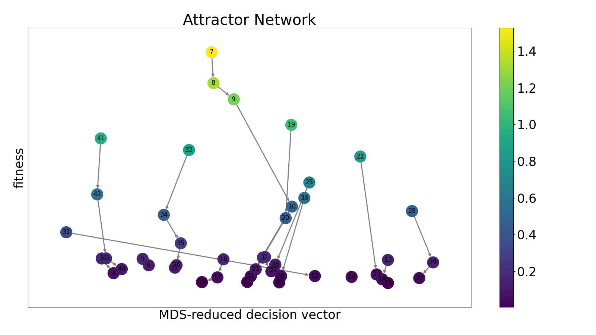

*Example attractor network visualization showing nodes (attractors) and edges (transitions) with node sizes representing visit frequency and colors indicating fitness values.*

---

### ECDF Plots

#### `plot_ecdf(data, fval_var="raw_y", eval_var="evaluations", free_vars=["algorithm_name"], maximization=False, f_min=None, f_max=None, scale_f_log=True, eval_values=None, eval_min=None, eval_max=None, scale_eval_log=True, *, ax=None, file_name=None, plot_args=None)`
Plot Empirical Cumulative Distribution Function (ECDF) based on Empirical Attainment Functions.

Creates line plots showing the cumulative probability of achieving different performance levels at various evaluation budgets, allowing comparison between algorithms or configurations.

**Args:**
- `data (pl.DataFrame)`: Input dataframe containing optimization algorithm trajectory data.
- `fval_var (str, optional)`: Which column contains the function/performance values. Defaults to "raw_y".
- `eval_var (str, optional)`: Which column contains the evaluation counts. Defaults to "evaluations".
- `free_vars (Iterable[str], optional)`: Which columns contain the grouping variables for distinguishing between different lines in the plot. Defaults to ["algorithm_name"].
- `maximization (bool, optional)`: Whether the optimization problem is maximization. Defaults to False.
- `f_min (int, optional)`: Minimum function value bound. If None, uses data minimum. Defaults to None.
- `f_max (int, optional)`: Maximum function value bound. If None, uses data maximum. Defaults to None.
- `scale_f_log (bool, optional)`: Whether function values should be log-scaled before normalization. Defaults to True.
- `eval_values (Iterable[int], optional)`: Specific evaluation points to plot. If None, uses eval_min/eval_max with scale_eval_log to sample points. Defaults to None.
- `eval_min (int, optional)`: Minimum evaluation bound. If None, uses data minimum. Defaults to None.
- `eval_max (int, optional)`: Maximum evaluation bound. If None, uses data maximum. Defaults to None.
- `scale_eval_log (bool, optional)`: Whether the evaluation axis should be log-scaled. Defaults to True.
- `ax (matplotlib.axes._axes.Axes, optional)`: Matplotlib axes to plot on. If None, creates new figure. Defaults to None.
- `file_name (Optional[str], optional)`: Path to save the plot. If None, plot is not saved. Defaults to None.
- `plot_args (dict | LinePlotArgs, optional)`: Plot styling arguments. Defaults to None.

**Returns:**
- `tuple[matplotlib.axes.Axes, pd.DataFrame]`: The matplotlib axes object and the processed dataframe used to create the plot.

**Example:**
```python
from iohinspector import (
    DataManager,
    plot_ecdf
)
import os

os.makedirs("example_plots", exist_ok=True)

manager = DataManager()
manager.add_folder("SO_Data")

df = manager.select(function_ids=[1]).load(True, True)
ax, data = plot_ecdf(
    df,
    file_name="example_plots/ecdf.png"
)
```

**Generated Plot:**
<br>
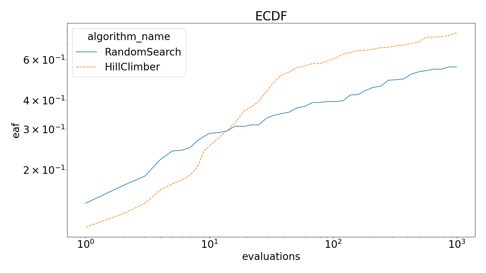

*Example ECDF plot showing cumulative distribution of performance across different algorithms at various evaluation budgets.*

---

### EAF Plots

#### `plot_eaf_single_objective(data, eval_var="evaluations", fval_var="raw_y", eval_min=None, eval_max=None, scale_eval_log=True, n_quantiles=100, *, ax=None, file_name=None, plot_args=None)`
Plot the Empirical Attainment Function (EAF) for single-objective optimization against budget.

Creates a heatmap visualization showing the probability of attaining different function values at different evaluation budgets across multiple algorithm runs.

**Args:**
- `data (pl.DataFrame)`: Input dataframe containing optimization algorithm trajectory data.
- `eval_var (str, optional)`: Which column contains the evaluation counts. Defaults to "evaluations".
- `fval_var (str, optional)`: Which column contains the function values. Defaults to "raw_y".
- `eval_min (int, optional)`: Minimum evaluation bound for the plot. If None, uses data minimum. Defaults to None.
- `eval_max (int, optional)`: Maximum evaluation bound for the plot. If None, uses data maximum. Defaults to None.
- `scale_eval_log (bool, optional)`: Whether the evaluations should be log-scaled. Defaults to True.
- `n_quantiles (int, optional)`: Number of discrete probability levels in the EAF heatmap. Defaults to 100.
- `ax (matplotlib.axes._axes.Axes, optional)`: Matplotlib axes to plot on. If None, creates new figure. Defaults to None.
- `file_name (Optional[str], optional)`: Path to save the plot. If None, plot is not saved. Defaults to None.
- `plot_args (dict | HeatmapPlotArgs, optional)`: Plot styling arguments. Defaults to None.

**Returns:**
- `tuple[matplotlib.axes.Axes, pl.DataFrame]`: The matplotlib axes object and the processed dataframe used to create the plot.

**Example:**
```python
from iohinspector import (
    DataManager,
    plot_eaf_single_objective
)
import os

os.makedirs("example_plots", exist_ok=True)

manager = DataManager()
manager.add_folder("SO_Data")

df = manager.select(function_ids=[1], algorithms=['HillClimber']).load(True, True)
ax, data = plot_eaf_single_objective(
    df,
    file_name="example_plots/eaf_single_objective.png"
)
```

**Generated Plot:**
<br>
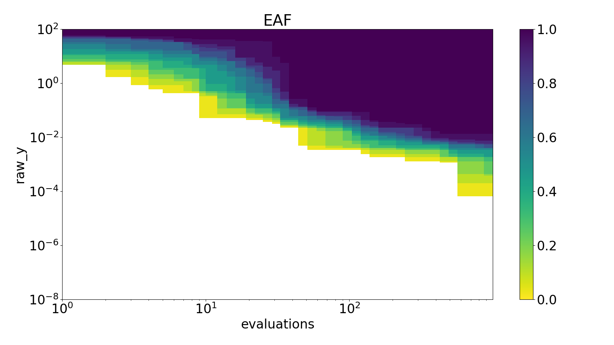

*Example EAF heatmap showing probability of attaining different function values at various evaluation budgets.*

#### `plot_eaf_pareto(data, obj1_var, obj2_var, *, ax=None, file_name=None, plot_args=None)`
Plot the Empirical Attainment Function (EAF) for multi-objective optimization with two objectives.

Creates a heatmap visualization showing the probability of attaining different combinations of objective values across multiple algorithm runs in the Pareto front space.

**Args:**
- `data (pl.DataFrame)`: Input dataframe containing multi-objective optimization trajectory data.
- `obj1_var (str)`: Which column contains the first objective values.
- `obj2_var (str)`: Which column contains the second objective values.
- `ax (matplotlib.axes._axes.Axes, optional)`: Matplotlib axes to plot on. If None, creates new figure. Defaults to None.
- `file_name (Optional[str], optional)`: Path to save the plot. If None, plot is not saved. Defaults to None.
- `plot_args (dict | HeatmapPlotArgs, optional)`: Plot styling arguments. Defaults to None.

**Returns:**
- `tuple[matplotlib.axes.Axes, pd.DataFrame]`: The matplotlib axes object and the EAF dataframe used to create the plot.

**Example:**
```python
from iohinspector import (
    DataManager,
    plot_eaf_pareto,
    add_normalized_objectives
)
import os

os.makedirs("example_plots", exist_ok=True)

manager = DataManager()
manager.add_folder("MO_Data")

df = manager.select(function_ids=[0], algorithms=['NSGA2']).load(False, False)
df = add_normalized_objectives(df, obj_vars = ['raw_y', 'F2'])

ax, data = plot_eaf_pareto(
    df,
    obj1_var="obj1",
    obj2_var="obj2",
    file_name="example_plots/eaf_pareto.png"
)
```

**Generated Plot:**
<br>
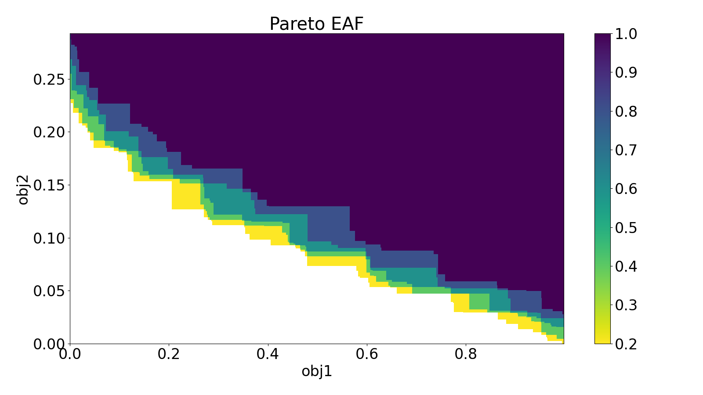

*Example EAF plot in Pareto space showing attainment probabilities for multi-objective optimization.*

#### `plot_eaf_diffs(data1, data2, obj1_var, obj2_var, *, ax=None, file_name=None, plot_args=None)`
Plot the Empirical Attainment Function (EAF) differences between two algorithms.

Creates a heatmap visualization showing the statistical differences in attainment probabilities between two algorithms in the objective space, highlighting regions where one algorithm performs better than the other.

**Args:**
- `data1 (pl.DataFrame)`: Input dataframe containing trajectory data for the first algorithm.
- `data2 (pl.DataFrame)`: Input dataframe containing trajectory data for the second algorithm.
- `obj1_var (str)`: Which column contains the first objective values.
- `obj2_var (str)`: Which column contains the second objective values.
- `ax (matplotlib.axes._axes.Axes, optional)`: Matplotlib axes to plot on. If None, creates new figure. Defaults to None.
- `file_name (Optional[str], optional)`: Path to save the plot. If None, plot is not saved. Defaults to None.
- `plot_args (dict | HeatmapPlotArgs, optional)`: Plot styling arguments. Defaults to None.

**Returns:**
- `tuple[matplotlib.axes.Axes, pd.DataFrame]`: The matplotlib axes object and the EAF differences dataframe used to create the plot.

**Example:**
```python
from iohinspector import (
    DataManager,
    plot_eaf_diffs,
    add_normalized_objectives
)
import os

os.makedirs("example_plots", exist_ok=True)

manager = DataManager()
manager.add_folder("MO_Data")

df1 = manager.select(function_ids=[0], algorithms=['NSGA2']).load(False, False)
df1 = add_normalized_objectives(df1, obj_vars = ['raw_y', 'F2'])

df2 = manager.select(function_ids=[0], algorithms=['SMS-EMOA']).load(False, False)
df2 = add_normalized_objectives(df2, obj_vars = ['raw_y', 'F2'])

ax, data = plot_eaf_diffs(
    df1,
    df2,
    obj1_var="obj1",
    obj2_var="obj2",
    file_name="example_plots/eaf_diffs.png"
)
```

**Generated Plot:**
<br>


*Example EAF differences plot showing statistical significance of performance differences between two algorithms in objective space.*

---

### Fixed Budget Plots

#### `plot_single_function_fixed_budget(data, eval_var="evaluations", fval_var="raw_y", free_vars=["algorithm_name"], eval_min=None, eval_max=None, maximization=False, measures=["geometric_mean"], *, ax=None, file_name=None, plot_args=None)`
Create a fixed-budget convergence plot showing algorithm performance over evaluation budgets.

Visualizes how different algorithms converge by plotting aggregate performance measures (geometric mean, median, etc.) against evaluation budgets, allowing direct comparison of convergence behavior across algorithms.

**Args:**
- `data (pl.DataFrame)`: Input dataframe containing optimization algorithm trajectory data.
- `eval_var (str, optional)`: Which column contains the evaluation counts. Defaults to "evaluations".
- `fval_var (str, optional)`: Which column contains the function/objective values. Defaults to "raw_y".
- `free_vars (Iterable[str], optional)`: Which columns contain the grouping variables for distinguishing between different lines in the plot. Defaults to ["algorithm_name"].
- `eval_min (float, optional)`: Minimum evaluation bound for the plot. If None, uses data minimum. Defaults to None.
- `eval_max (float, optional)`: Maximum evaluation bound for the plot. If None, uses data maximum. Defaults to None.
- `maximization (bool, optional)`: Whether the optimization problem is maximization. Defaults to False.
- `measures (Iterable[str], optional)`: Aggregate measures to plot. Valid options are "geometric_mean", "mean", "median", "min", "max". Defaults to ["geometric_mean"].
- `ax (matplotlib.axes._axes.Axes, optional)`: Matplotlib axes to plot on. If None, creates new figure. Defaults to None.
- `file_name (str, optional)`: Path to save the plot. If None, plot is not saved. Defaults to None.
- `plot_args (dict | LinePlotArgs, optional)`: Plot styling arguments. Defaults to None.

**Returns:**
- `tuple[matplotlib.axes.Axes, pl.DataFrame]`: The matplotlib axes object and the processed (melted/filtered) dataframe used to create the plot.

**Example:**
```python
from iohinspector import (
    DataManager,
    plot_single_function_fixed_budget
)
import os

os.makedirs("example_plots", exist_ok=True)

manager = DataManager()
manager.add_folder("SO_Data")

df = manager.select(function_ids=[1]).load(True, True)
ax, data = plot_single_function_fixed_budget(
    df,
    file_name="example_plots/fixed_budget.png"
)
```

**Generated Plot:**
<br>
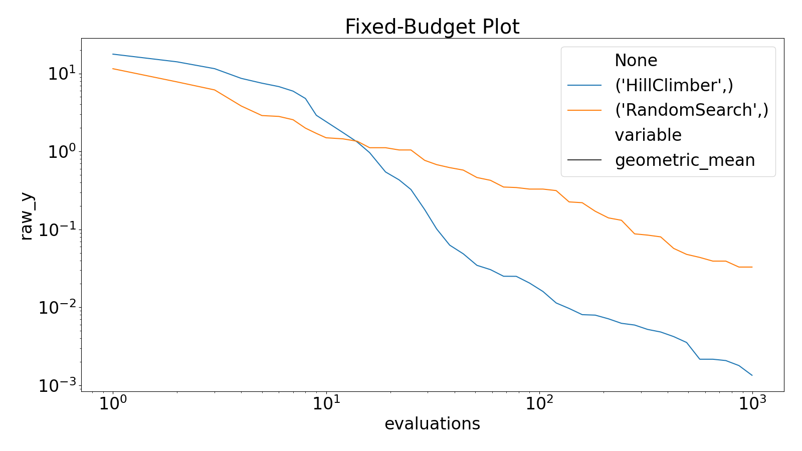

*Example fixed-budget convergence plot showing algorithm performance over evaluation budgets with geometric mean and median measures.*

---

### Fixed Target Plots

#### `plot_single_function_fixed_target(data, eval_var="evaluations", fval_var="raw_y", free_vars=["algorithm_name"], f_min=None, f_max=None, scale_f_log=True, eval_max=None, maximization=False, measures=["ERT"], *, ax=None, file_name=None, plot_args=None)`
Create a fixed-target plot showing Expected Running Time (ERT) analysis for algorithm performance.

Visualizes how much computational budget (evaluations) algorithms need to reach specific target performance levels, allowing comparison of algorithm efficiency across different difficulty targets.

**Args:**
- `data (pl.DataFrame)`: Input dataframe containing optimization algorithm trajectory data.
- `eval_var (str, optional)`: Which column contains the evaluation counts. Defaults to "evaluations".
- `fval_var (str, optional)`: Which column contains the function/objective values. Defaults to "raw_y".
- `free_vars (Iterable[str], optional)`: Which columns contain the grouping variables for distinguishing between different lines in the plot. Defaults to ["algorithm_name"].
- `f_min (float, optional)`: Minimum function value bound for target range. If None, uses data minimum. Defaults to None.
- `f_max (float, optional)`: Maximum function value bound for target range. If None, uses data maximum. Defaults to None.
- `scale_f_log (bool, optional)`: Whether function values should be log-scaled for target sampling. Defaults to True.
- `eval_max (int, optional)`: Maximum evaluation budget to consider. If None, uses data maximum. Defaults to None.
- `maximization (bool, optional)`: Whether the optimization problem is maximization. Defaults to False.
- `measures (Iterable[str], optional)`: Running time measures to plot. Valid options are "ERT", "mean", "PAR-10", "min", "max". Defaults to ["ERT"].
- `ax (matplotlib.axes._axes.Axes, optional)`: Matplotlib axes to plot on. If None, creates new figure. Defaults to None.
- `file_name (str, optional)`: Path to save the plot. If None, plot is not saved. Defaults to None.
- `plot_args (dict | LinePlotArgs, optional)`: Plot styling arguments. Defaults to None.

**Returns:**
- `tuple[matplotlib.axes.Axes, pl.DataFrame]`: The matplotlib axes object and the processed (melted/filtered) dataframe used to create the plot.

**Example:**
```python
from iohinspector import (
    DataManager,
    plot_single_function_fixed_target
)
import os

os.makedirs("example_plots", exist_ok=True)

manager = DataManager()
manager.add_folder("SO_Data")

df = manager.select(function_ids=[1]).load(True, True)
ax, data = plot_single_function_fixed_target(
    df,
    file_name="example_plots/fixed_target.png"
)
```

**Generated Plot:**
<br>
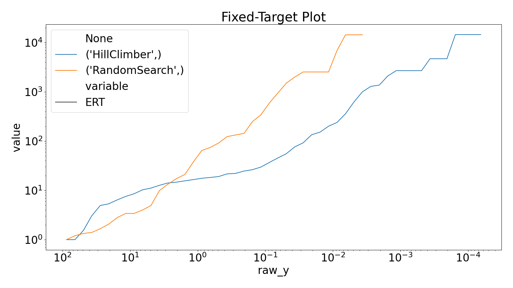

*Example fixed-target ERT plot showing expected running time to reach different performance targets for multiple algorithms.*

---

### Multi-Objective Plots

#### `plot_paretofronts_2d(data, obj1_var="raw_y", obj2_var="F2", free_var="algorithm_name", *, ax=None, file_name=None, plot_args=None)`
Visualize 2D Pareto fronts for multi-objective optimization algorithms.

Creates a scatter plot showing the non-dominated solutions (Pareto fronts) achieved by different algorithms in a two-objective space, allowing visual comparison of algorithm performance and trade-off quality.

**Args:**
- `data (pl.DataFrame)`: Input dataframe containing multi-objective optimization trajectory data.
- `obj1_var (str, optional)`: Which column contains the first objective values. Defaults to "raw_y".
- `obj2_var (str, optional)`: Which column contains the second objective values. Defaults to "F2".
- `free_var (str, optional)`: Which column contains the grouping variable for distinguishing between different algorithms/categories. Defaults to "algorithm_name".
- `ax (matplotlib.axes._axes.Axes, optional)`: Matplotlib axes to plot on. If None, creates new figure. Defaults to None.
- `file_name (str, optional)`: Path to save the plot. If None, plot is not saved. Defaults to None.
- `plot_args (dict | ScatterPlotArgs, optional)`: Plot styling arguments. Defaults to None.

**Returns:**
- `tuple[matplotlib.axes.Axes, pd.DataFrame]`: The matplotlib axes object and the Pareto front dataframe used to create the plot.

**Example:**
```python
from iohinspector import (
    DataManager,
    plot_paretofronts_2d
)
import os

os.makedirs("example_plots", exist_ok=True)

manager = DataManager()
manager.add_folder("MO_Data")

df = manager.select().load(True, True)

ax, data = plot_paretofronts_2d(
    df,
    obj1_var="raw_y",
    obj2_var="F2",
    file_name="example_plots/pareto_fronts.png"
)
```

**Generated Plot:**
<br>
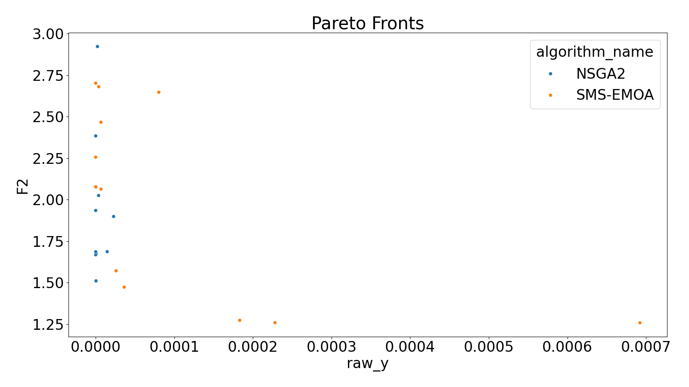

*Example 2D Pareto fronts visualization showing non-dominated solutions achieved by different algorithms in objective space.*

#### `plot_indicator_over_time(data, obj_vars=["raw_y", "F2"], indicator=None, free_var="algorithm_name", eval_min=1, eval_max=50_000, scale_eval_log=True, eval_steps=50, *, ax=None, file_name=None, plot_args=None)`
Plot the anytime performance of multi-objective quality indicators over evaluation budgets.

Creates line plots showing how quality indicators (like hypervolume, IGD, etc.) evolve over the course of algorithm runs, enabling comparison of convergence behavior and solution quality improvement across different algorithms.

**Args:**
- `data (pl.DataFrame)`: Input dataframe containing multi-objective optimization trajectory data.
- `obj_vars (Iterable[str], optional)`: Which columns contain the objective values for indicator calculation. Defaults to ["raw_y", "F2"].
- `indicator (object, optional)`: Quality indicator object from iohinspector.indicators module. Defaults to None.
- `free_var (str, optional)`: Which column contains the grouping variable for distinguishing between different algorithms. Defaults to "algorithm_name".
- `eval_min (int, optional)`: Minimum evaluation bound for the time axis. Defaults to 1.
- `eval_max (int, optional)`: Maximum evaluation bound for the time axis. Defaults to 50_000.
- `scale_eval_log (bool, optional)`: Whether the evaluation axis should be log-scaled. Defaults to True.
- `eval_steps (int, optional)`: Number of evaluation points to sample between eval_min and eval_max. Defaults to 50.
- `ax (matplotlib.axes._axes.Axes, optional)`: Matplotlib axes to plot on. If None, creates new figure. Defaults to None.
- `file_name (Optional[str], optional)`: Path to save the plot. If None, plot is not saved. Defaults to None.
- `plot_args (dict | LinePlotArgs, optional)`: Plot styling arguments. Defaults to None.

**Returns:**
- `tuple[matplotlib.axes.Axes, pd.DataFrame]`: The matplotlib axes object and the indicator performance dataframe used to create the plot.

**Example:**
```python
from iohinspector import (
    DataManager,
    plot_indicator_over_time,
    add_normalized_objectives,
    get_reference_set,
    IGDPlus
)

manager = DataManager()
manager.add_folder("MO_Data")

df = manager.select(function_ids=[1]).load(False, True)
df = add_normalized_objectives(df, obj_vars = ['raw_y', 'F2'])
ref_set = get_reference_set(df, ['obj1', 'obj2'], 1000)

igdp_indicator = IGDPlus(reference_set = ref_set)

ax, data = plot_indicator_over_time(
    df, ['obj1', 'obj2'], igdp_indicator, 
    eval_min=10, eval_max=2000, eval_steps=50, free_var='algorithm_name',
    file_name="example_plots/indicator_over_time.png"
)
```

**Generated Plot:**
<br>
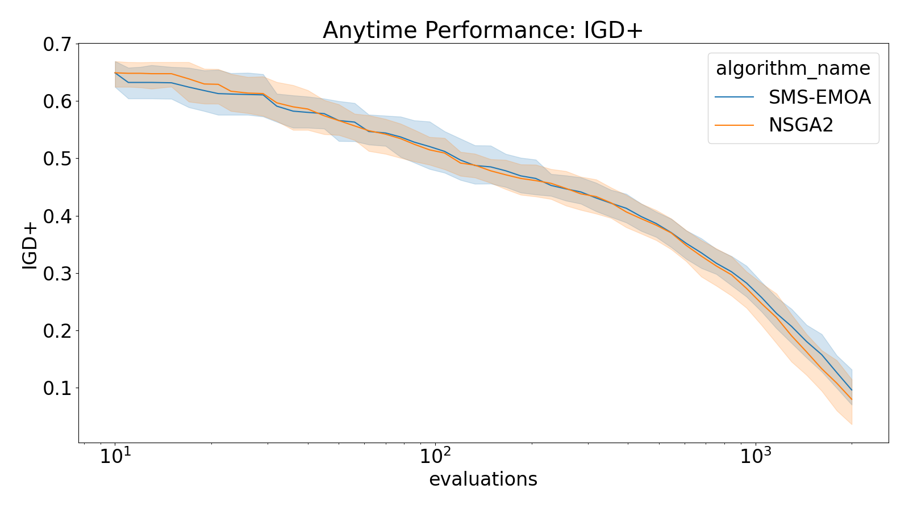

*Example plot showing hypervolume indicator evolution over evaluation time for multiple multi-objective algorithms.*

---

### Ranking Plots

#### `plot_tournament_ranking(data, alg_vars=["algorithm_name"], fid_vars=["function_name"], fval_var="raw_y", nrounds=25, maximization=False, *, ax=None, file_name=None, plot_args=None)`
Plot ELO ratings from tournament-style algorithm competition across multiple problems.

Creates a point plot with error bars showing ELO ratings calculated from pairwise algorithm competitions. In each round, all algorithms compete against each other on every function, with performance samples determining winners and ELO rating updates.

**Args:**
- `data (pl.DataFrame)`: Input dataframe containing algorithm performance trajectory data.
- `alg_vars (Iterable[str], optional)`: Which columns contain the algorithm identifiers that will compete. Defaults to ["algorithm_name"].
- `fid_vars (Iterable[str], optional)`: Which columns contain the problem/function identifiers for competition. Defaults to ["function_name"].
- `fval_var (str, optional)`: Which column contains the performance values. Defaults to "raw_y".
- `nrounds (int, optional)`: Number of tournament rounds to simulate. Defaults to 25.
- `maximization (bool, optional)`: Whether the performance should be maximized. Defaults to False.
- `ax (matplotlib.axes._axes.Axes, optional)`: Matplotlib axes to plot on. If None, creates new figure. Defaults to None.
- `file_name (str, optional)`: Path to save the plot. If None, plot is not saved. Defaults to None.
- `plot_args (dict | BasePlotArgs, optional)`: Plot styling arguments. Defaults to None.

**Returns:**
- `tuple[matplotlib.axes.Axes, pd.DataFrame]`: The matplotlib axes object and the ELO ratings dataframe used to create the plot.

**Example:**
```python
from iohinspector import (
    DataManager,
    plot_tournament_ranking
)

manager = DataManager()
manager.add_folder("SO_Data")

df = manager.select(function_ids=[1]).load(True, True)
ax, data = plot_tournament_ranking(
    df,
    file_name="example_plots/tournament_rankings.png"
)
```

**Generated Plot:**
<br>
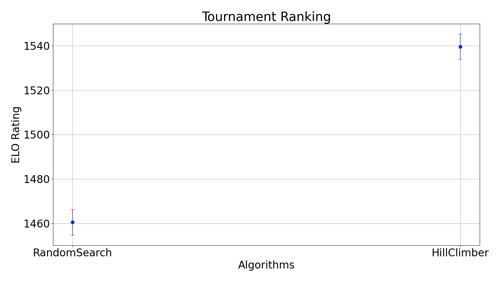

*Example tournament ranking plot showing ELO ratings with error bars for algorithms competing across multiple benchmark functions.*

#### `plot_robustrank_over_time(data, obj_vars, evals, indicator, *, file_name=None)`
Plot robust ranking confidence intervals at distinct evaluation timesteps.

Creates multiple subplots showing robust ranking analysis with confidence intervals for algorithm performance at different evaluation budgets, using statistical comparison methods to handle uncertainty in performance measurements.

**Args:**
- `data (pl.DataFrame)`: Input dataframe containing algorithm performance trajectory data. Must contain data for a single function only.
- `obj_vars (Iterable[str])`: Which columns contain the objective values for ranking calculation.
- `evals (Iterable[int])`: Evaluation timesteps at which to compute and plot rankings.
- `indicator (object)`: Quality indicator object from iohinspector.indicators module.
- `file_name (Optional[str], optional)`: Path to save the plot. If None, plot is not saved. Defaults to None.

**Returns:**
- `tuple[np.ndarray, tuple]`: Array of matplotlib axes objects and a tuple containing (comparison, benchmark) data used for the robust ranking analysis.

**Example:**
```python
from iohinspector import (
    DataManager,
    plot_robustrank_over_time,
    IGDPlus,
    get_reference_set,
    add_normalized_objectives
)

manager = DataManager()
manager.add_folder("MO_Data")

df = manager.select(function_ids=[1]).load(True, True)
df = add_normalized_objectives(df, obj_vars = ['raw_y', 'F2'])
ref_set = get_reference_set(df, ['obj1', 'obj2'], 1000)

igdp_indicator = IGDPlus(reference_set = ref_set)
evals = [10,100,1000,2000]

ax, (comparison, benchmark) = plot_robustrank_over_time(
    df,
    obj_vars=['obj1', 'obj2'],
    evals=evals,
    indicator=igdp_indicator,
    file_name="example_plots/robustrank_over_time.png"
)
```

**Generated Plot:**
<br>
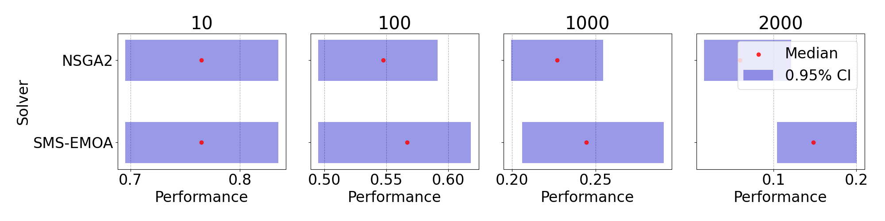

*Example robust ranking analysis showing confidence intervals for algorithm performance at different evaluation timesteps.*

#### `plot_robustrank_changes(data, obj_vars, evals, indicator, *, ax=None, file_name=None)`
Plot robust ranking changes over evaluation timesteps as connected line plots.

Creates a line plot showing how algorithm rankings evolve over time, with lines connecting ranking positions across different evaluation budgets to visualize ranking stability and performance trajectory changes.

**Args:**
- `data (pl.DataFrame)`: Input dataframe containing algorithm performance trajectory data.
- `obj_vars (Iterable[str])`: Which columns contain the objective values for ranking calculation.
- `evals (Iterable[int])`: Evaluation timesteps at which to compute rankings and plot changes.
- `indicator (object)`: Quality indicator object from iohinspector.indicators module.
- `ax (matplotlib.axes._axes.Axes, optional)`: Matplotlib axes to plot on. If None, creates new figure. Defaults to None.
- `file_name (Optional[str], optional)`: Path to save the plot. If None, plot is not saved. Defaults to None.

**Returns:**
- `tuple[matplotlib.axes.Axes, object]`: The matplotlib axes object and the ranking comparisons data used to create the plot.

**Example:**
```python
from iohinspector import (
    DataManager,
    plot_robustrank_changes,
    IGDPlus,
    get_reference_set,
    add_normalized_objectives
)

manager = DataManager()
manager.add_folder("MO_Data")

df = manager.select(function_ids=[1]).load(True, True)
df = add_normalized_objectives(df, obj_vars = ['raw_y', 'F2'])
ref_set = get_reference_set(df, ['obj1', 'obj2'], 1000)

igdp_indicator = IGDPlus(reference_set = ref_set)
evals = [10,100,1000,2000]

ax, comparison = plot_robustrank_changes(
    df,
    obj_vars=['obj1', 'obj2'],
    evals=evals,
    indicator=igdp_indicator,
    file_name="example_plots/robustrank_changes.png"
)
```

**Generated Plot:**
<br>
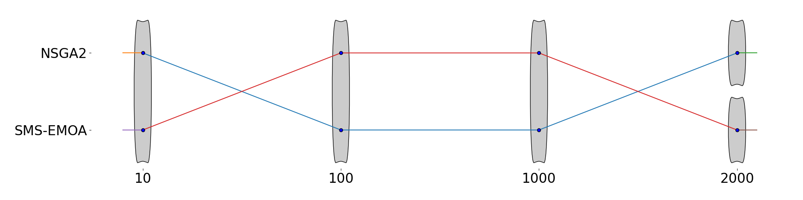

*Example ranking changes plot showing how algorithm rankings evolve over evaluation time with connected line trajectories.*

---

### Single Run Plots

#### `plot_heatmap_single_run(data, vars, eval_var="evaluations", var_mins=[-5], var_maxs=[5], *, ax=None, file_name=None, plot_args=None)`
Create a heatmap visualization showing search space exploration patterns in a single algorithm run.

Visualizes how an optimization algorithm explores the search space over time by showing the density of evaluations across different variable dimensions and evaluation budgets, revealing search patterns and exploration behavior.

**Args:**
- `data (pl.DataFrame)`: Input dataframe containing trajectory data from a single algorithm run. Must contain data for exactly one run (unique data_id).
- `vars (Iterable[str])`: Which columns contain the decision/search space variables to visualize.
- `eval_var (str, optional)`: Which column contains the evaluation counts. Defaults to "evaluations".
- `var_mins (Iterable[float], optional)`: Minimum bounds for the search space variables. Should be same length as vars. Defaults to [-5].
- `var_maxs (Iterable[float], optional)`: Maximum bounds for the search space variables. Should be same length as vars. Defaults to [5].
- `ax (matplotlib.axes._axes.Axes, optional)`: Matplotlib axes to plot on. If None, creates new figure. Defaults to None.
- `file_name (Optional[str], optional)`: Path to save the plot. If None, plot is not saved. Defaults to None.
- `plot_args (dict | HeatmapPlotArgs, optional)`: Plot styling arguments. Defaults to None.

**Returns:**
- `tuple[matplotlib.axes.Axes, pd.DataFrame]`: The matplotlib axes object and the processed heatmap dataframe used to create the plot.

**Example:**
```python
from iohinspector import (
    DataManager,
    plot_heatmap_single_run
)

manager = DataManager()
manager.add_folder("SO_Data")

df = manager.select(function_ids=[1], data_ids=[1], algorithms=["RandomSearch"]).load(True, True)

ax, data = plot_heatmap_single_run(
    df,
    vars = ["x0","x1"],
    var_mins=[-5,-5],
    var_maxs=[5,5],
    file_name="example_plots/heatmap_single_run.png"
)
```

**Generated Plot:**
<br>
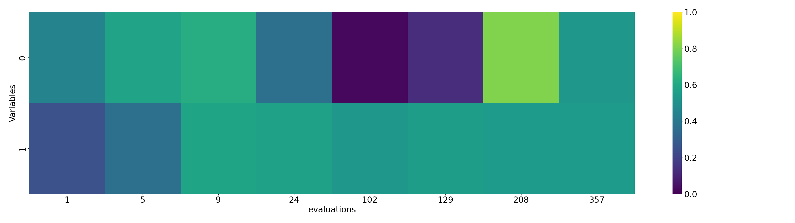

*Example search space exploration heatmap showing algorithm evaluation density across decision variables and evaluation timesteps.*

---

## Notes

- All functions support both Polars and Pandas DataFrames as input/output
- Plot functions return both the matplotlib axes object and the processed data
- All plotting functions support customizable styling through plot_args parameters

For more detailed usage examples and tutorials, see the examples directory in the repository.